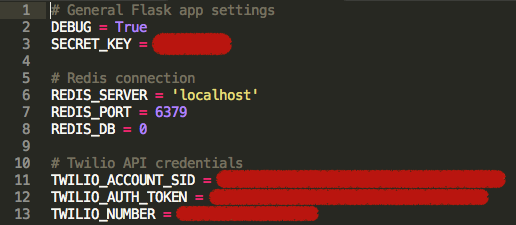

# Presentations

From now on I am going to use [Reveal.js](http://lab.hakim.se/reveal-js/#/) to do my presentations. This is where I store the presentation's source code.

## List of presentations

- [Outils numérique et ingénierie collective](app/static/content/ingenierie-collective.md)

## Setup

- You need Python.
- Install the required libraries with ``pip install -r requirements.txt``.
- You need a ``config.py`` script to setup Flask. Mine looks like this:



The Redis and Twilio credentials are only needed for interactive presentations. Indeed, for some presentations you can [make the audience choose the next slide](https://www.twilio.com/blog/2014/11/choose-your-own-adventure-presentations-with-reveal-js-python-and-websockets.html). For this you also have to install

- [``ngrok``](https://ngrok.com/download) to create a tunnel towards your localhost, this will enable Twilio to update the Redis database. Put it into the top level of this repository.
- [Redis](http://redis.io/download)

## Usage

```sh
python run.py
```

If you want to share the presentation, run the previous command and then run

```
./ngrok http 5000
```

and voilà. The console you launched ngrok in will give you a URL that links to the presentation. This is also needed for making the audience choose the slide via Twilio.
